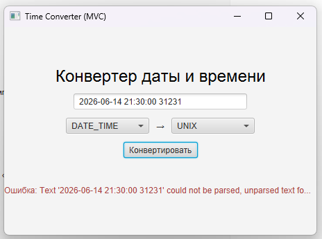
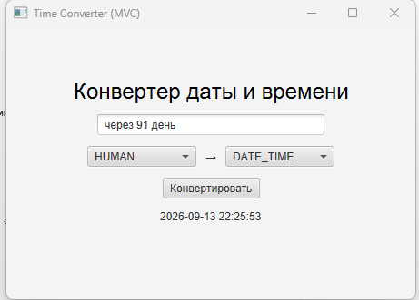
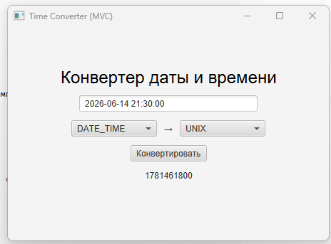

# Лабораторная работа №1

### Конвертер с архитектурой MVC

### Вариант 15

### Студент: Зырянов Алексей Александрович, группа збИСТ-231

---

## Цель работы

Целью данной лабораторной работы является освоение базовых компонентов JavaFX, а также практическое применение архитектурного подхода Model–View–Controller (MVC) при разработке настольного приложения.

---

## Задание

В рамках работы необходимо разработать графическое приложение «Конвертер», реализующее преобразование значений между различными единицами измерения.

### Основные требования:

- Поддержка не менее 3 единиц измерения
- Корректная работа с дробными числами
- Обработка ошибок ввода пользователя
- Использование архитектуры MVC

### Вариант 15:

- Типы конвертации:
    - Дата/Время
    - Unix Timestamp
    - Человеческий формат (“через 2 дня”)
- Особенность: форматирование времени

---

## Архитектура MVC

### Model (Модель)

Модель представлена классом `ConverterModel` и отвечает за:

- хранение коэффициентов преобразования
- выполнение вычислений
- независимость от пользовательского интерфейса

---

### View (Представление)

Представление реализовано через `FXML` файл (`ConverterView.fxml`) и содержит:

- `TextField` для ввода значения
- `ComboBox` для выбора единиц измерения (from / to)
- `Button` для запуска конвертации
- `Label` для вывода результата
- `Label` для отображения ошибок

Для стилизации интерфейса дополнительно подключён BootstrapFX, что улучшает внешний вид приложения.

---

### Controller (Контроллер)

Контроллер реализован в классе `ConverterController` и отвечает за:

- связь View и Model
- обработку пользовательских событий
- валидацию ввода
- обновление интерфейса

Контроллер реализует интерфейс `Initializable`.

---

## Тестирование

При тестировании приложения были проверены следующие сценарии:

### Корректные данные:

* Ввод числа `10`
* Выбор единиц измерения (m → cm)
* Результат отображается корректно

### Дробные числа:

* Ввод `2.5`
* Конвертация выполняется без ошибок

### Ошибочные данные:

* Пустой ввод → сообщение об ошибке
* Ввод текста → сообщение "Введите число"
* Отрицательные значения → сообщение "Число должно быть > 0"

---

## Интерфейс приложения

Интерфейс разработан с использованием JavaFX и BootstrapFX.
Он включает:

* поля ввода и выбора единиц
* кнопку конвертации
* область вывода результата
* область отображения ошибок

### Пример успешной конвертации:

### Пример ошибоной конвертации текста:

### Пример пустого ввода при конвертации:

---

## Вывод

В ходе выполнения лабораторной работы было разработано JavaFX-приложение с архитектурой MVC.

В процессе работы:

* изучены основы JavaFX
* реализовано разделение логики по MVC
* разработана модель конвертации
* реализована валидация пользовательского ввода
* создан графический интерфейс с использованием FXML
* подключена стилизация через BootstrapFX

Таким образом, цель работы была достигнута.