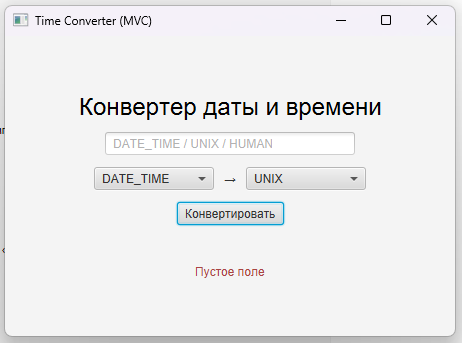

# Лабораторная работа №1

### Конвертер с архитектурой MVC

### Вариант 15

### Студент: Зырянов Алексей Александрович, группа збИСТ-231

---

## Цель работы

Целью данной лабораторной работы является освоение базовых компонентов JavaFX, а также практическое применение архитектурного подхода Model–View–Controller (MVC) при разработке настольного приложения с обработкой и преобразованием временных форматов.

---

## Задание

В рамках работы необходимо разработать графическое приложение «Конвертер», реализующее преобразование значений между различными форматами представления даты и времени.

### Основные требования:

- Поддержка не менее 3 форматов представления данных
- Корректная обработка пользовательского ввода
- Обработка ошибок ввода пользователя
- Использование архитектуры MVC

### Вариант 15:

- Типы конвертации:
  - Дата/Время (формат `yyyy-MM-dd HH:mm:ss`)
  - Unix Timestamp
  - Человеческий формат (“через 2 дня”, “через 5 часов”)
- Особенность: преобразование временных значений между различными представлениями с учетом текущего времени системы

---

## Архитектура MVC

### Model (Модель)

Модель представлена классом `ConverterModel` и отвечает за:

- преобразование между различными форматами времени
- работу с `Instant`, `LocalDateTime` и системным временем
- реализацию логики парсинга человеческого формата времени
- преобразование в Unix Timestamp и обратно
- независимость от пользовательского интерфейса

---

### View (Представление)

Представление реализовано через `FXML` файл (`ConverterView.fxml`) и содержит:

- `TextField` для ввода значения
- `ComboBox` для выбора исходного формата (from)
- `ComboBox` для выбора целевого формата (to)
- `Button` для запуска конвертации
- `Label` для вывода результата
- `Label` для отображения ошибок

Интерфейс оформлен с использованием BootstrapFX. Реализована карточная структура (card layout), обеспечивающая визуальное разделение логических блоков: заголовок, ввод данных и результат.

---

### Controller (Контроллер)

Контроллер реализован в классе `ConverterController` и отвечает за:

- связь View и Model
- обработку пользовательских событий
- валидацию ввода
- обработку ошибок конвертации
- обновление интерфейса

Контроллер реализует интерфейс `Initializable` и выполняет инициализацию значений ComboBox.

---

## Тестирование

При тестировании приложения были проверены следующие сценарии:

### Корректные данные:

* Ввод формата `2026-06-14 21:30:00`
* Конвертация в Unix Timestamp
* Результат отображается корректно

### Unix Timestamp:

* Ввод числового значения времени
* Конвертация в формат даты/времени
* Корректное отображение результата

### Человеческий формат:

* Ввод `через 2 дня`
* Преобразование в дату/время относительно текущего момента системы

### Ошибочные данные:

* Пустой ввод → сообщение об ошибке
* Некорректный формат даты → сообщение об ошибке парсинга
* Неверный человеческий формат → сообщение об ошибке преобразования

---

## Интерфейс приложения

Интерфейс разработан с использованием JavaFX и BootstrapFX.

Он включает:

* поле ввода значения
* выбор формата "from" и "to"
* кнопку конвертации
* область вывода результата
* область отображения ошибок
* карточную структуру интерфейса (header / input / result)

### Пример успешной конвертации 1:

### Пример успешной конвертации 2:

### Пример ошибочной конвертации:

### Пример пустого ввода при конвертации:

---

## Вывод

В ходе выполнения лабораторной работы было разработано JavaFX-приложение с архитектурой MVC.

В процессе работы:

* изучены основы JavaFX
* реализовано разделение логики по MVC
* разработана модель преобразования временных форматов
* реализована обработка Unix Timestamp и DateTime
* реализован парсинг человеческого формата времени
* реализована валидация пользовательского ввода
* создан графический интерфейс с использованием FXML
* выполнено оформление интерфейса с использованием BootstrapFX и карточной структуры

Таким образом, цель работы была достигнута.